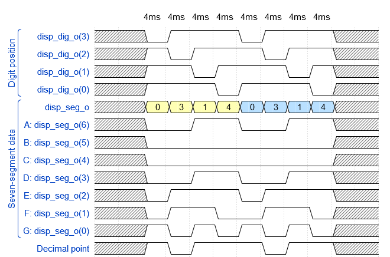

Homework

1.

    
2.

Combinational process - output of combinational process depends only on the present input. It works constantly. 
Sequential process - has memory and depends also on previous inputs. Outputs are connected to inputs. Change of the circuit state can be controlled by clock signal (for a synchronous sequential circuits).  
