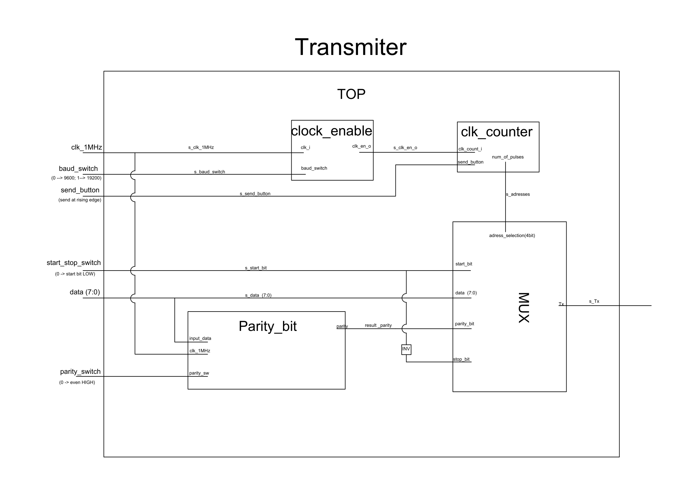

# Project: UART transmitter

### Popis zadania
UART (Universal asynchronous receiver/transmitter) vysielač s nastaviteľnými parametrami UART rámca, dátového slova a voľby jednej z dvoch prednastavených štandardných symbolových rýchlostí za chodu aplikácie. Je predpokladaná implementácia top vrstvy na CoolRunner-II CPLD starter board. 

### Popis implementácie

TBD

### Moduly

TBD

### Code description

TBD

### Schéma zapojenia

Schéma zapojenia top vrstvy

### Výsledky

TBD

### Zdrojové súbory

TBD

### Zdroje

<https://en.wikipedia.org/wiki/Universal_asynchronous_receiver-transmitter>

© Filip Paul, Tomáš Galgánek
