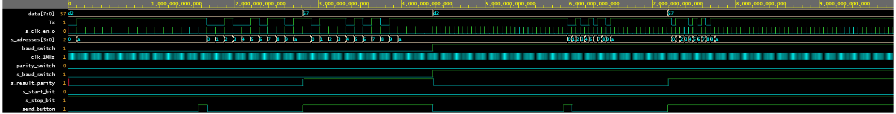
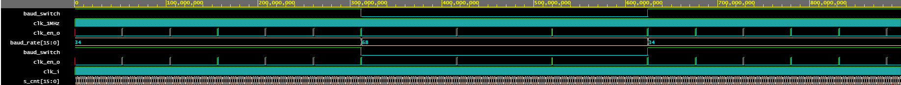
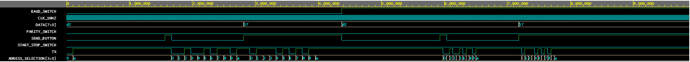
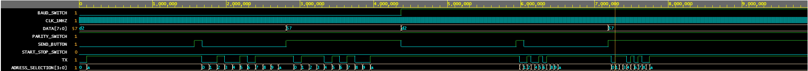
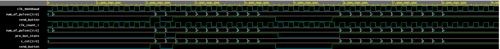
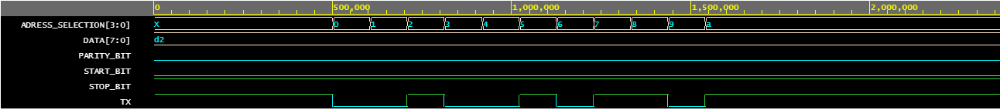
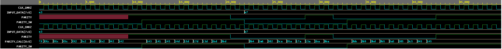

# Project: UART transmitter

### Popis zadania
Úlohou bolo navrhnúť a odsimulovať UART (Universal asynchronous receiver/transmitter) vysielač s nastaviteľnými parametrami UART rámca, dátového slova a voľby jednej z dvoch prednastavených štandardných symbolových rýchlostí za chodu aplikácie. Bola predpokladaná implementácia top vrstvy na CoolRunner-II CPLD starter board. 

UART (Universal asynchronous receiver/transmitter) je pomenovanie pre zariadenie slúžiace na asynchrónnu sériovú komunikáciu s nastaviteľnými parametrami posielaných dát, možnosťou nastavenia znakovej rýchlosti (baud rate) .

### Popis implementácie

TBD

### Moduly

Námi navrhnutý transmitter se skládá ze 4 hlavních modulů (viz Obr. Schéma zapojení top vrstvy). Hlavní myšlenkou celého návrhu je využití multiplexeru k přeměně paraelního vstupu k sériovému výstupu. Modul "clock_enable" slouží k vytváření pomalejšího hodinového signálu o volitelné frekvenci (baud rate), výstup takto zpomaleného hodinového signálu vstupuje do modulu "clk_counter", který funguje jako čítač hodinových pulzů. Výstup čítače je 4bitové slovo, které slouží k výběru adresy multiplexeru. Čítač počítá pulzy od 0 do 10 (od 0 do "a" v HEX), jakmile čítač napočítá do 10 ("a" HEX) zůstane v tomto stavu do doby, než detekuje nástupnou hranu od send_buttonu při které se resetuje. To, že na výstupu čítače zůstává 10 ("a" HEX) zapříčiní, že výstup multiplexeru je stop bit v době nevysílání žádných dat slova.

Posledním modulem je "parity_bit", tento modul je generátorem parity bitu, který je připojen na předposlední adresu multiplexeru. Generace parity bitu probíhá pomocí postupného porovnávání jednotlivých bitů vstupního slova a to tak, že v prvním kroce vygeneruje výsledek funkce XOR z "parity_switch" (slouží k změně parity bitu, zda při sudosti bude parity bit 1 nebo 0) a prvního datového bitu, tento výsledek je pak znovu "XORován" z druhým datovým bitem atd... Generace parity bitu tak trvá 8 hodinových impulzů o interní frekvenci 1MHz. Bohužel při generaci parity bitu může docházet k nesprávným výsledkům při změně vstupního slova to znamená, že správná generace parity bitu může trvat maximálně 16 hodinových impulzů o frekvenci 1MHz. Z důvodu, že parity bit je vysílaný až jako 10 bit v pořadí při frekvenci maximálně 19200 Hz není nutné tento nedostatek odstraňovat.

Návrh obsahuje několik nedostatků a to hlavně, když dojde ke změně datového slova při jeho odesílání neobsahuje totiž žádný paměťový modul, kde by se vstupní slovo zaznamenalo a pak odeslalo. Tento modul si však myslím, že není potřebný a to hlavně z důvodu, že odesílání datového slova je podmíněno náběžnou hranou "send_buttonu".

### Schéma zapojení

  Obr. 1. Schéma zapojení top vrstvy.

### Výsledky

Obr. 2. Časový priebeh simulácie transmitteru.

Obr. 3. Prepínanie znakovej rýchlosti.

Obr. 4. Lichá parita.

Obr. 5. Sudá parita.

Obr. 6. Časový priebeh - testbench pre čítací modul (clk_counter).

Obr. 7. Časový priebeh - testbench pre multiplexer (MUX modul).

Obr. 8. Časový priebeh - testbench pre modul parity_bit.

### Zdrojové súbory

* [MUX.vhd](https://github.com/tomgalg/Digital-electronics-1/blob/master/labs/project/MUX/MUX.vhd)
* [tb_MUX.vhd](https://github.com/tomgalg/Digital-electronics-1/blob/master/labs/project/MUX/tb_MUX.vhd)
* [clock_enable.vhd](https://github.com/tomgalg/Digital-electronics-1/blob/master/labs/project/clock_enable/clock_enable.vhd)
* [tb_clock_enable.vhd](https://github.com/tomgalg/Digital-electronics-1/blob/master/labs/project/clock_enable/tb_clock_enable.vhd)
* [parity_bit.vhd](https://github.com/tomgalg/Digital-electronics-1/blob/master/labs/project/parity_bit/parity_bit.vhd)
* [tb_parity_bit.vhd](https://github.com/tomgalg/Digital-electronics-1/blob/master/labs/project/parity_bit/tb_parity_bit.vhd)
* [clk_counter.vhd](https://github.com/tomgalg/Digital-electronics-1/blob/master/labs/project/CLK_counter/clk_counter.vhd)
* [tb_clk_counter.vhd](https://github.com/tomgalg/Digital-electronics-1/blob/master/labs/project/CLK_counter/tb_clk_counter.vhd)

### Zdroje a použitá literatura

* [1] Prednášky z predmetu Digitální Elektronika 1, návody a zdrojové súbory k cvičeniam od p. doc. Frýzy
* [2] *Universal_asynchronous_receiver-transmitter.* Wikipedia. [online]. Dostupné z URL: <https://en.wikipedia.org/wiki/Universal_asynchronous_receiver-transmitter>

***Made by Filip Paul & Tomáš Galgánek***
